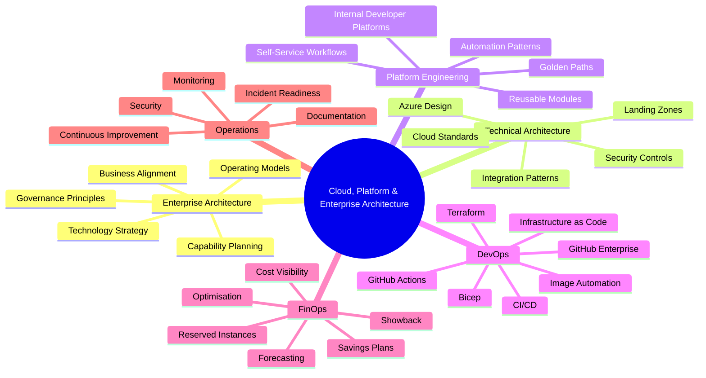
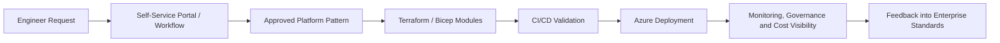

# 👋 Hey, I'm Elijah

### Cloud Engineer · Technical Architect · Platform Engineering · FinOps · DevOps

I work across **Azure cloud engineering, enterprise architecture, technical architecture, platform engineering, DevOps and FinOps**, helping design and improve cloud platforms that are secure, automated, governed, cost-aware and operationally scalable.

My focus is on building cloud environments that are not just deployed, but properly engineered: repeatable, observable, secure, financially transparent and aligned to wider business and enterprise architecture goals.

---

## 🧭 What I focus on

---

## 🏢 Enterprise architecture

I’m interested in enterprise architecture because it connects cloud engineering decisions to the bigger picture: business outcomes, operating models, governance, risk, cost, service ownership and long-term technology direction.

For me, enterprise architecture is not just documentation or diagrams. It is about making sure platforms are designed in a way that supports the organisation, scales across teams, and remains understandable and maintainable over time.

| Area | What this means in practice |
|---|---|
| **Business alignment** | Connecting cloud platform decisions to wider business goals, service outcomes and operational needs |
| **Technology strategy** | Helping shape standards, patterns and direction for Azure, DevOps, platform engineering and cloud governance |
| **Operating models** | Designing platforms and processes that teams can actually consume, support and improve |
| **Governance** | Defining sensible guardrails around security, cost, identity, access, tagging, policy and compliance |
| **Capability planning** | Understanding what people, process and technology capabilities are needed to make cloud services scalable |
| **Architecture communication** | Turning complex technical designs into clear diagrams, decision records, documentation and stakeholder-friendly summaries |

---

## 🏗️ Technical architecture experience

I have experience working across the design, improvement and operationalisation of Azure-based platforms, with a strong focus on balancing technical quality, business requirements, enterprise standards and long-term maintainability.

Areas I commonly work across include:

| Area | Experience |
|---|---|
| **Enterprise Architecture** | Aligning cloud platform decisions to business goals, operating models, governance expectations and long-term technology strategy |
| **Azure Architecture** | Designing and improving Azure environments, subscriptions, networking, identity, governance and operational controls |
| **Landing Zones** | Structuring scalable Azure landing zone patterns with management groups, policies, RBAC, networking and subscription design |
| **Cloud Governance** | Tagging, policy, access control, security baselines, monitoring and operational standards |
| **Platform Engineering** | Creating reusable patterns, automation workflows and self-service approaches for engineering teams |
| **DevOps & IaC** | Building repeatable deployments using Terraform, Bicep, GitHub Actions and automation-first delivery |
| **FinOps** | Improving Azure cost visibility, forecasting, optimisation, showback and financial accountability |
| **Operational Enablement** | Turning technical designs into usable processes, documentation, reporting and supportable services |

---

## 🚀 Platform engineering

I’m particularly interested in platform engineering because it brings together enterprise architecture, technical architecture, DevOps, automation, governance and developer experience.

For me, a good platform should provide:

- clear standards
- reusable building blocks
- automated deployment paths
- sensible guardrails
- security and governance by default
- cost visibility from the start
- a better experience for engineers and application teams

---

## 💰 FinOps focus

I also have a strong interest in FinOps and cloud financial management, especially in Azure environments where cost visibility, optimisation and accountability are essential.

My FinOps focus areas include:

| FinOps Area | What I care about |
|---|---|
| **Cost Visibility** | Making spend understandable across subscriptions, resource groups, tags, customers and services |
| **Forecasting** | Helping teams understand expected growth, budget risk and future cloud demand |
| **Optimisation** | Rightsizing, reservation analysis, Savings Plans, orphaned resources and waste reduction |
| **Showback / Chargeback** | Making cloud costs visible to the right teams, departments or customers |
| **Governance** | Using tagging, policy and reporting standards to improve financial accountability |
| **Managed Service Delivery** | Building repeatable FinOps processes that can scale beyond manual spreadsheet analysis |

---

## 🛠️ Tech I work with

  
  
  
  
  
  
  
  
  
  
  
  
  
  
  
  

---

## 🧱 Current direction

I’m currently going deeper into:

- Enterprise architecture practices for cloud platforms, governance and operating models
- Azure landing zone architecture and automation
- Platform engineering using internal developer platform patterns
- Terraform module design and reusable deployment workflows
- GitHub Enterprise and GitHub Actions for infrastructure validation and delivery
- Packer-based image automation for repeatable server builds
- FinOps tooling, reporting and optimisation for Azure environments
- Cloud governance, security baselines and operational standards
- Building scalable services that reduce manual operational effort

---

## 📌 Featured projects

### ☁️ Azure Cloud Resume

A hands-on Azure project covering static web hosting, serverless functions, API integration, frontend development and cloud deployment patterns.

> Repo: [`azureCloudResume`](https://github.com/mafiaboy1994/azureCloudResume)

---

### 🧱 Terraform Basics

A learning and practice repository for Terraform fundamentals, infrastructure definitions and repeatable cloud deployment patterns.

> Repo: [`TerraformBasics`](https://github.com/mafiaboy1994/TerraformBasics)

---

### 🔷 Azure Bicep Deployments

Azure Bicep examples for deploying resource groups, networking and infrastructure components.

> Repos:
>
> - [`Bicep-RG-Deployments-`](https://github.com/mafiaboy1994/Bicep-RG-Deployments-)
> - [`bicepNetworkDeployment`](https://github.com/mafiaboy1994/bicepNetworkDeployment)
> - [`newActiveDirectoryDomain-ha-2-dc-zones`](https://github.com/mafiaboy1994/newActiveDirectoryDomain-ha-2-dc-zones)

---

## 🧠 How I think about cloud and enterprise engineering

I like engineering that connects the technical, operational, financial and business sides of cloud.

A strong cloud platform should be:

- aligned to business and enterprise architecture goals
- technically well designed
- secure by default
- cost-aware
- automated where possible
- easy for engineers to consume
- measurable and supportable
- documented well enough for others to operate

---

## 🧪 Homelab & learning

Outside of work, I use my homelab to explore infrastructure patterns in a safe environment.

Current areas of interest include:

- Hyper-V and VMware based lab environments
- pfSense routing, firewalling and VLAN design
- Linux server automation
- Kubernetes fundamentals
- Packer image builds
- Terraform-driven infrastructure
- Ansible configuration management

---

## 📈 GitHub stats

---

## 🤝 Connect

  

---

### ⚡ Building better cloud platforms, one commit at a time.

